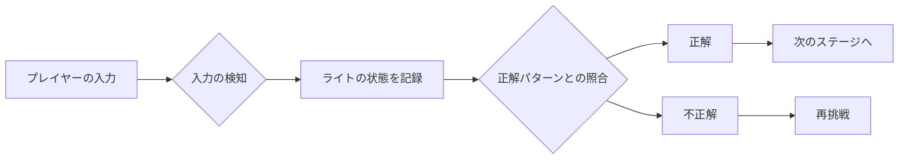

# ゲーム仕様
光ったパネルの順番どおりにユーザはパネルを押下することを目的としています。
ゲームは、ページロード後3秒のカウントダウンを経て自動的に開始されます。

## ゲームデザイン
### 1.1 ステージ構成
ステージ1〜9：通常のWebゲーム。ライトの点灯パターンを再現するパズル。
ステージ10：リアルタイムのリモートライトパズル。ラズベリーパイとLEDライトパネルを使用。

### 1.2 難易度設定
ステージ1：シンプルなパターン（3つのライト）
ステージ2：ライトの数が増える（4つのライト）
ステージ3〜9：ライトの数や点灯パターンの複雑さが増していく
ステージ10：リアルタイムで同じパターンを再現する

# ゲーム設計
## ゲームフロー
### 0. ゲーム開始
ページロード後、3秒のカウントダウンを表示。
カウントダウン終了後、自動的にゲームを開始。

### 1. 正解パターンの生成
正解パターンとは、パネルが光る順番です。
ランダムに選ばれたライトが点灯するパターンを生成。
続けて同じボタンにならないようにする。

### 2. お手本
正解パターンを実演する。

### 2. プレイヤーパターンの記録
プレイヤーが操作するたびに、現在のライトの状態を配列に記録。

### 3. 照合アルゴリズム
比較: プレイヤーの入力したパターンと正解パターンを逐一比較。

結果の判定: 全てのライトが一致すれば「正解」として次のステージへ進む。
一致しない場合は「不正解」として再挑戦させる。

## プレイヤーの入力検知
### 1. インターフェースの設計
ライトパネル: 複数のライト（LED）を格子状に配置したパネル。
ライト: 各ライトは個別にクリックやタップで操作可能。

### 2. 入力検知の方法
クリック/タップイベント: 各ライトに対してクリックまたはタップイベントをリスンし、プレイヤーの操作を検知。

## 状態遷移
| No. |論理名 | 意味 |  処理 |遷移先 |
| - | - | - | - | - | 
| 00 | INIT | 初期状態 | ページロード後、3秒のカウントダウンを表示。01に遷移する。| 01 |
| 01 | START | ステージ初期状態 | ランダムに正解を作成する。02に遷移する。| 02 |
| 02 | SHOW | お手本を見せる | 正解を順番に表示する。Readyと表示した後 03に遷移する。| 03 |
| 03 | PLAY | ユーザプレイ | 制限時間を設け、失敗した場合、タイムオーバーになった場合は ステージ1に戻る。正解の順番どおりタッチできれば次のステージに遷移する。 | 01 |

# インターフェースデザインの詳細
## 1. レイアウト
### フレーム全体
ライトパネルのみが配置されている。

### ライトパネル:

4x4のグリッドに配置（16個のライト）。
各ライトは50px x 50pxの正方形。
各ライトの間には10pxのマージン。

タイプ：ボタン

## 2. 色とスタイル
### 背景色:

全体の背景色は#f0f0f0（薄いグレー）。
### ライトパネルのスタイル:

オフ状態：#d3d3d3（ライトグレー）。
オン状態：#ffd700（ゴールド）。
マウスオーバー：#bdbdbd
マウスクリック：ライトブルー
ユーザー選択：無効（テキスト選択を防ぐ）
カーソル：デフォルト（または非表示）

### ボタンのスタイル:

背景色：#4CAF50（グリーン）。
テキスト色：#ffffff（白）。
フォントサイズ：16px。
ボーダー：なし。
ボーダーラディウス：5px（角を丸くする）。
## 3. フォント
フォントファミリー:
全体のフォントは "Arial, sans-serif"。
## 4. 配置
コンテナ:
画面中央に配置。
幅：90%。
マージン：0 auto（上下の中央に配置）。
テキストの中央揃え。

# フロント設計書
## 使用言語
html
javascript
css

# フロントエンド構成
├── templates/  
│   └── index.html  
├── static/  
│   ├── css/  
│   │   └── style.css  
│   ├── js/  
│   │   ├── game.js  
│   │   ├── phaser.min.js  
│   │   └── webrtc_adapter.js  
│   └── assets/  
│       ├── images/  
│       └── sounds/  